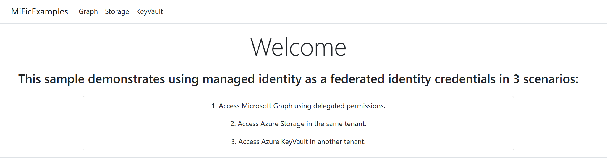

# Using managed identity as an App credential.
This .NET sample demonstrates using a managed identity to authenticate an app. 

Find more details on how to use this feature refer to [Configuring an application to trust a managed identity](https://learn.microsoft.com/en-us/entra/workload-id/workload-identity-federation-config-app-trust-managed-identity)

> Code snippets for other languages can be found in this article: [Implementation guide and code snippets](guide-and-snippets.md)

This sample includes 3 scenarios using a managed identity as an App credential:
1) Accessing Microsoft Graph to get list of users in the active directory.
2) Accessing am Azure Blob Storage.
3) Accessing a Key Vault in a different tenant.

The below guide walks you through building the environment (Azure Web App, Storage Account, and a Key Vault) and deploying the sample code.

---

## **Prerequisites**
Before starting, ensure the following:
- Access to an Azure account with sufficient permissions to create resources in your subscription [Create Azure account](https://azure.microsoft.com/en-us/pricing/purchase-options/azure-account?msockid=1507b04c45bb6ac30a95a4ca445b6bb1)
- An active Azure subscription
- Azure CLI installed and configured on your machine [How to install the Azure CLI](https://learn.microsoft.com/en-us/cli/azure/install-azure-cli?view=azure-cli-latest)
- powershell 7+ installed [Install PowerShell on Windows, Linux, and macOS](https://learn.microsoft.com/en-us/powershell/scripting/install/installing-powershell?view=powershell-7.5)
- .NET 9 SDK installed [Download .NET 9.0](https://dotnet.microsoft.com/en-us/download/dotnet/9.0)
- IDE of your choice.

Alternatively, you can use DevContainers setup. For that you'll need just the following:
- Visual Studio Code [Download Visual Studio Code](https://code.visualstudio.com/download)
- Docker [Install Docker](https://docs.docker.com/engine/install/)

Optional: Access to a different Azure subscription with permisiosn to create Key Vaults. You will need this for testing cross-tenant access.

---

## **Setup overview**
You can setup the sample by running the Setup/setup.ps1 powershell script. The script automates the provisioning and configuration of various Azure resources needed by the sample's code:
1. Resource Group
2. Storage Account and Container
3. Managed Identity
4. App Service Plan and Web App
5. Azure AD Application Registration
6. Azure Key Vault and Secrets
7. Federated Identity Credential
8. Application Configuration (`appsettings.json`)

Alternatively, you can adapt the script to only provision the resources you need.

## **Download the code and run the setup script**
1. Clone the repository to your local environment.
2. Navigate to the `./Setup` folder.
2. Update the script parameters as needed:
   - `RESOURCE_PREFIX`: A prefix that will be used to name all the Azure resources.
   - `LOCATION`: The Azure region for resource deployment.

### Example execution
```powershell
.\setup.ps1 -RESOURCE_PREFIX "SampleApp" -LOCATION "northeurope"
```

This will create all resources and deploy the app to Azure.

## **Browse the web app**
Now navigate to your web app url. If unsure, you should find the url in the `MetadataOnly` section in your appsettings.

You should see the following page.


## **Remote Key Vault**
If you want to try Remote KV scenario with us, please add your App ID to the doc: [Key Vault Sample](https://1drv.ms/w/s!AlF40yjNFS7gsi5mqdHU8lEmKZhs?e=xIq6ex)

## **Clean Up Resources**
After testing, clean up resources to avoid incurring charges:

```powershell
.\cleanup.ps1 -TENANT "<tenant-id>" -SUBSCRIPTION "<subscription-id>" -RESOURCE_PREFIX "SampleApp"
```
---
This sample demonstrates using a managed identity to authenticate an app. Find more details on how to use this feature refer to [Configuring an application to trust a managed identity](https://learn.microsoft.com/en-us/entra/workload-id/workload-identity-federation-config-app-trust-managed-identity)
